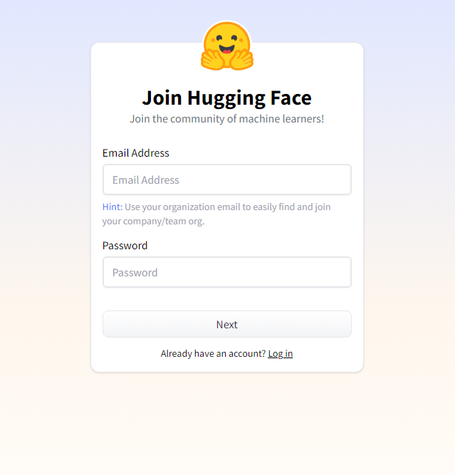
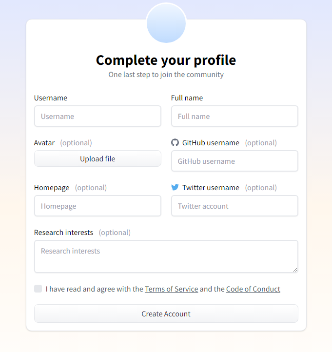
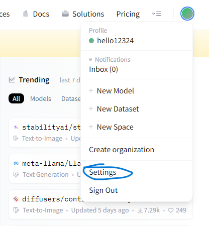
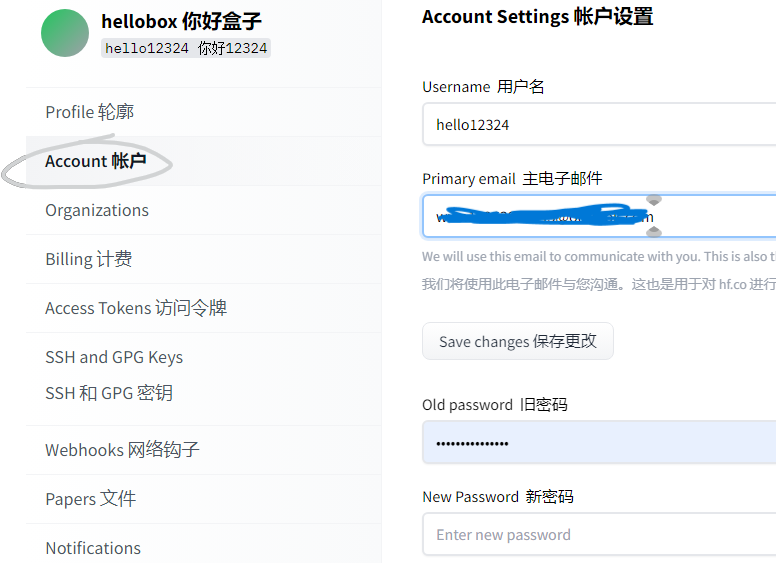
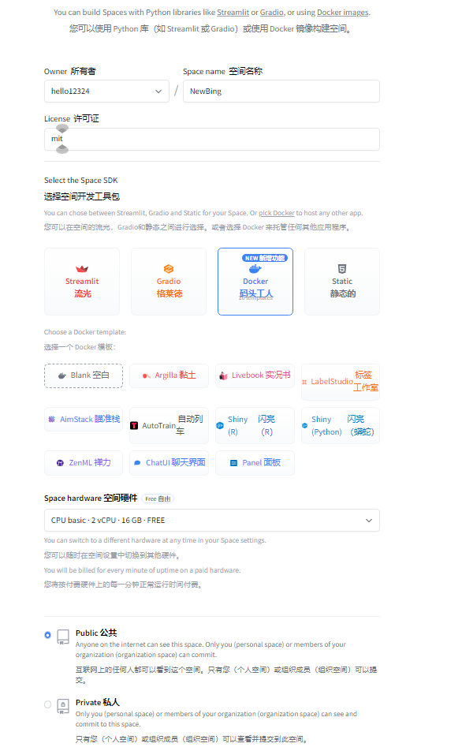
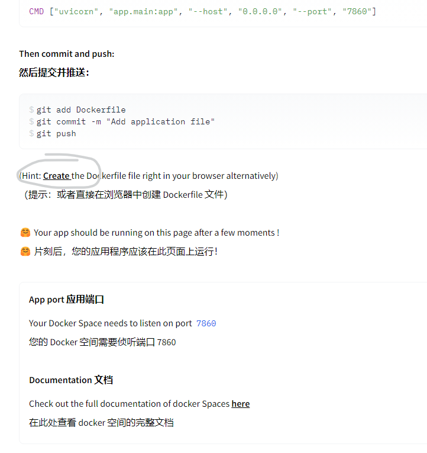
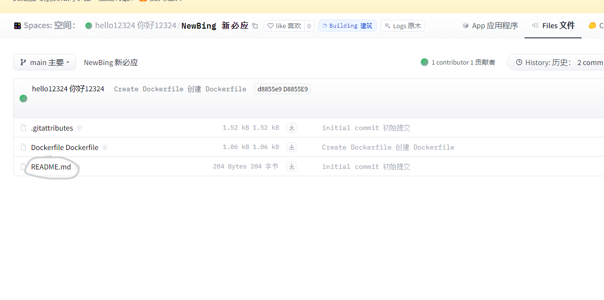
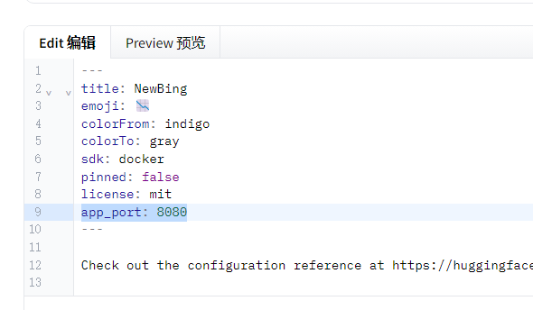
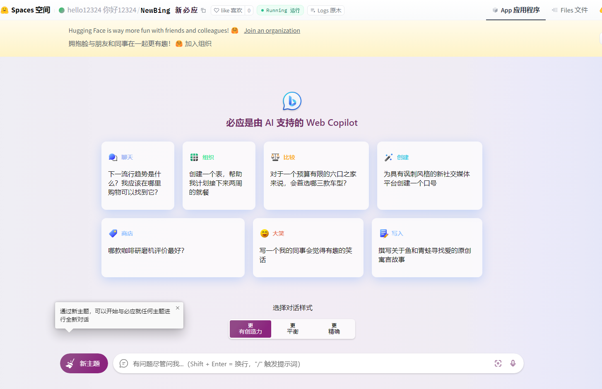

大家好，我是红石Hong，欢迎来到我的个人博客

接下来，我将用十分钟，教你搭建一个国内可用的NewBing

#### 无需魔法

#### 无需候补账号

#### 无需服务器，域名

#### 小白也能部署的网站！

接下来，让我们开始吧

## 注册HuggingFace账号

我们需要前往[HuggingFace](https://huggingface.co/)注册一个账号 



然后我们需要输入我们的邮箱和密码（这里要求大小写字母+数字）

然后我们点击Next



这里只需要填写Username与FullName即可

注册成功后我们要验证我们的邮箱

点击头像，选择设置





选择account选项卡后在Primary email下方会有一个验证按钮

点击后会向邮箱中发送一封验证邮件，点击邮件中的链接即可完成验证

## 开始搭建NewBing项目

我们需要点击上栏spaces按钮来到空间页面

并点击creat new space


然后我们需要配置一下空间



大概像我这样填就可以了

```
这个是介绍可改选项的
1.space name 控制项目名称及以后生成的域名
2.space hardware：控制配置的，不差钱可以选择别的选项
```

然后我们点击下方的create space

接下来我们需要向下拉，找到带有下划线的Create



点击它进入dockerfile

然后将下面的源码原封不动的复制到edit中

##### 代码

```
# Build Stage
# 使用 golang:alpine 作为构建阶段的基础镜像
FROM golang:alpine AS builder

# 添加 git，以便之后能从GitHub克隆项目
RUN apk --no-cache add git

# 从 GitHub 克隆 go-proxy-bingai 项目到 /workspace/app 目录下
RUN git clone https://github.com/Harry-zklcdc/go-proxy-bingai.git /workspace/app

# 设置工作目录为之前克隆的项目目录
WORKDIR /workspace/app

# 编译 go 项目。-ldflags="-s -w" 是为了减少编译后的二进制大小
RUN go build -ldflags="-s -w" -tags netgo -trimpath -o go-proxy-bingai main.go

# Runtime Stage
# 使用轻量级的 alpine 镜像作为运行时的基础镜像
FROM alpine

# 设置工作目录
WORKDIR /workspace/app

# 从构建阶段复制编译后的二进制文件到运行时镜像中
COPY --from=builder /workspace/app/go-proxy-bingai .

# 设置环境变量，此处为随机字符
ENV Go_Proxy_BingAI_USER_TOKEN_1="kJs8hD92ncMzLaoQWYtX5rG6bE3fZ4iO2FEyJ"

# 暴露8080端口
EXPOSE 8080

# 容器启动时运行的命令
CMD ["/workspace/app/go-proxy-bingai"]
```

完成后点击commit new file to main即可

但我们还没有彻底完成

我们需要返回文件目录，找到README.md文件



点击并进入编辑（edit）界面



在下方添加

#### 代码

```
app_port: 8080
```

点击下方的commit change to main即可

之后我们需要前往App界面



就可以看到我们的bing部署好了

（喂，不去我的[B站主页](https://space.bilibili.com/522549816)看看吗？）
